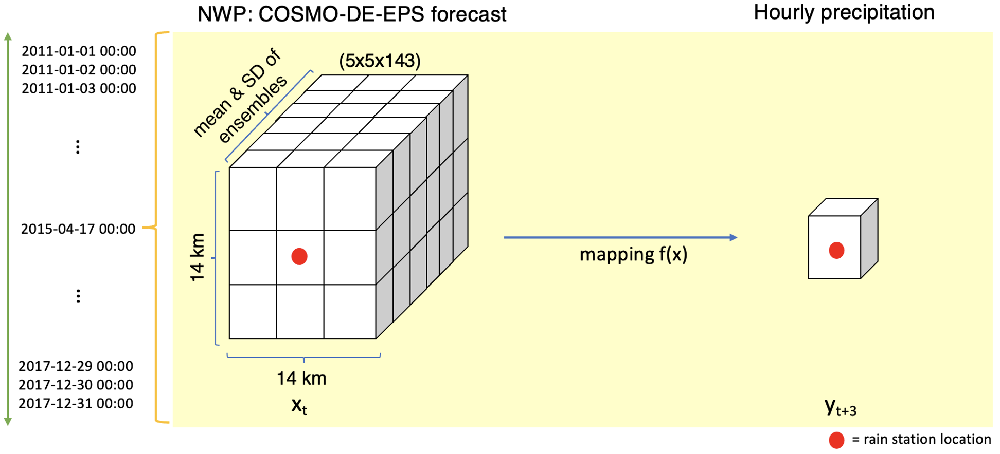
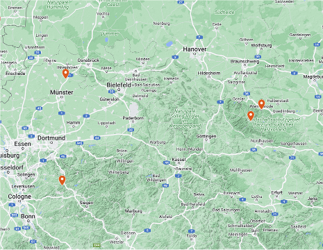
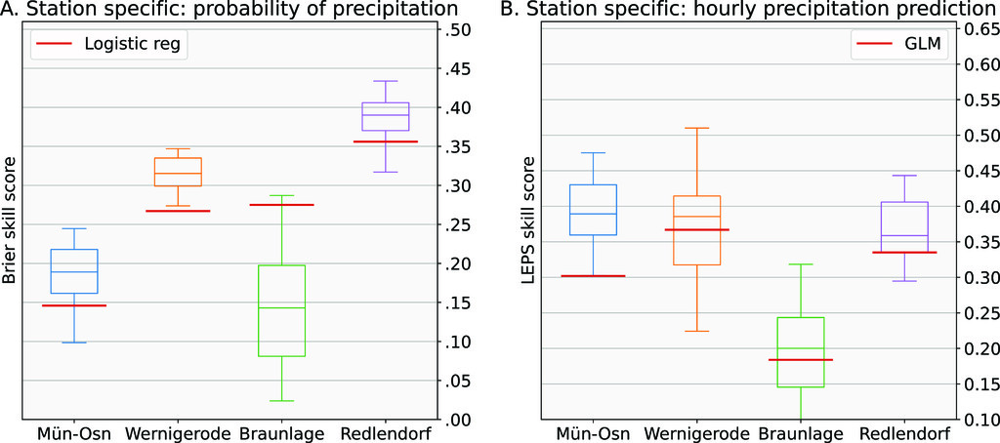
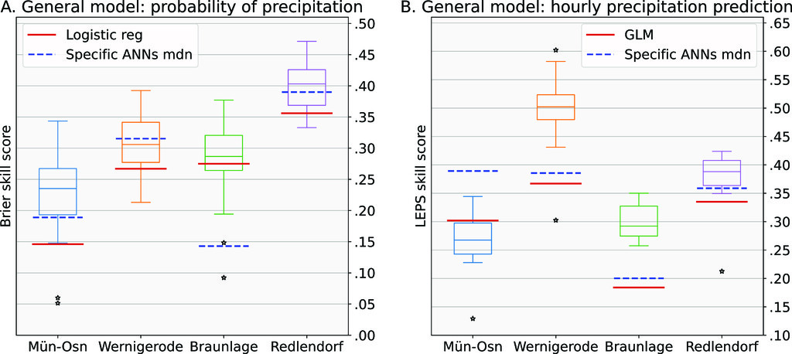

# ANNs Time Series Precipitation
ANNs for the stocastic estimation of future precipitation in 4 German cities

## Description
Project to generate probabilistic precipitation 3h forecast based on the physical simulations (Numerical Weather Prediction) for 4 locations in Germany.

Prediction task was split in two independent goals:
- Probability of rain
- Distribution of registered rain

## Table of Contents
- [ANNs Time Series Precipitation](#anns-time-series-precipitation)
  - [Description](#description)
  - [Table of Contents](#table-of-contents)
  - [Project Structure](#project-structure)
    - [Preprocessing](#preprocessing)
    - [Search arch](#search-arch)
    - [Probabilistic classification](#probabilistic-classification)
    - [Probabilistic regression](#probabilistic-regression)
    - [Illustrator](#illustrator)
  - [Datasets:](#datasets)
  - [Models](#models)
  - [Results](#results)
  - [License](#license)
  - [Publication](#publication)

## Project Structure

### Preprocessing
It loads the dataset, handles missing values, normalizes the data, and split it into training and testing sets. This preparation ensures the data is suitable for training artificial neural networks.

### Search arch
It defines neural network models, conducts grid or random searches for hyperparameter tuning, and evaluates different architectures to identify the most effective model.

### Probabilistic classification
It defines and trains neural network models for estimating the probability of rain, and analyzing the models' performance using metrics such as accuracy, precision, recall, and ROC curves.

### Probabilistic regression
It defines and trains neural network models for regression tasks, and analyzing the models' performance using metrics like mean squared error and uncertainty quantification. This approach aims to predict continuous precipitation values while accounting for uncertainty in the predictions.

### Illustrator
It visualizes the results of neural network models for precipitation time series data. Key steps include loading the model predictions, comparing them to actual values, and generating various plots such as time series plots and error distribution plots. 

## Datasets:

We train and test the models for 4 locations in Germany: Münster-Osnabrück, Wernigerode, Braunlage & Redlendorf. Datasets can be downloaded [here](https://b2share.eudat.eu/records/c765674ad42c4a46bc3b0fa780f3329b).

## Models
Probabilistic Artificial Neural Networks to predict:
- Probability of rain (yes/no).
- Distribution of rain (gamma shaped distribution).

## Results

ANNs models outperform the predictions made by the physical models and the statistical correction, as it can be shown in the figures:

## License
CC BY-NC-ND 4.0 license.

## Publication
A complete report of the project and performance of the algorithms was published [here](https://journals.ametsoc.org/view/journals/wefo/38/3/WAF-D-21-0207.1.xml) in the [Weather and Forecasting](https://journals.ametsoc.org/view/journals/wefo/wefo-overview.xml) journal of the [American Metereological Society](https://www.ametsoc.org/index.cfm/ams/)

> Abstract: This study analyzes the potential of deep learning using probabilistic artificial neural networks (ANNs) for postprocessing ensemble precipitation forecasts at four observation locations. We split the precipitation forecast problem into two tasks: estimating the probability of precipitation and predicting the hourly precipitation. We then compare the performance with classical statistical postprocessing (logistical regression and GLM). ANNs show a higher performance at three of the four stations for estimating the probability of precipitation and at all stations for predicting the hourly precipitation. Further, two more general ANN models are trained using the merged data from all four stations. These general ANNs exhibit an increase in performance compared to the station-specific ANNs at most stations. However, they show a significant decay in performance at one of the stations at estimating the hourly precipitation. The general models seem capable of learning meaningful interactions in the data and generalizing these to improve the performance at other sites, which also causes the loss of local information at one station. Thus, this study indicates the potential of deep learning in weather forecasting workflows.